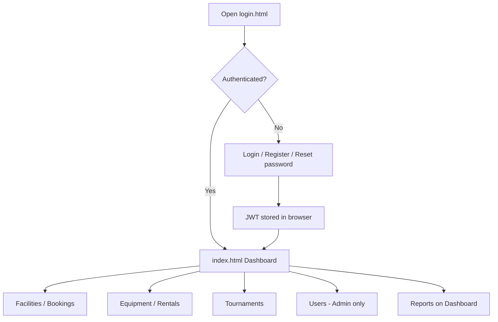
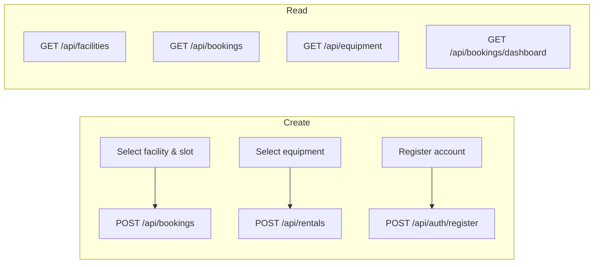
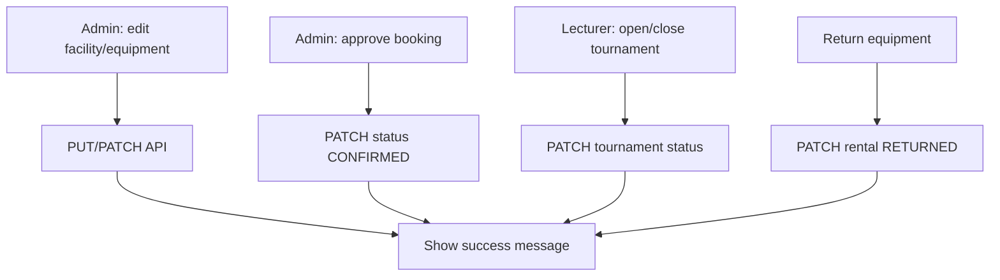
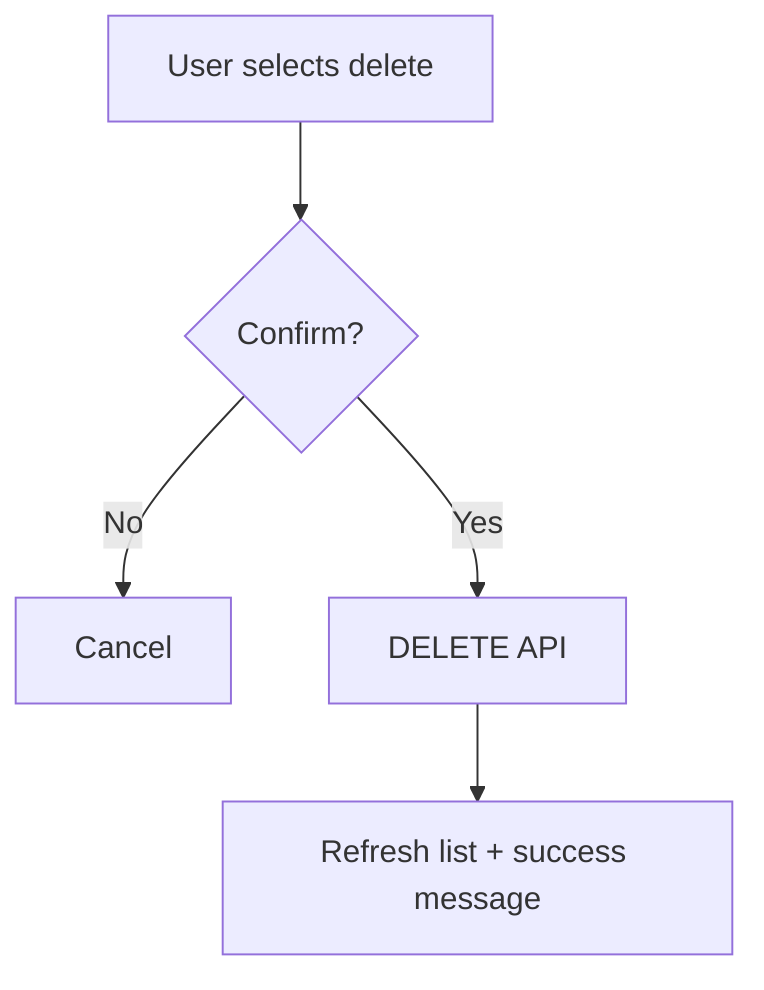
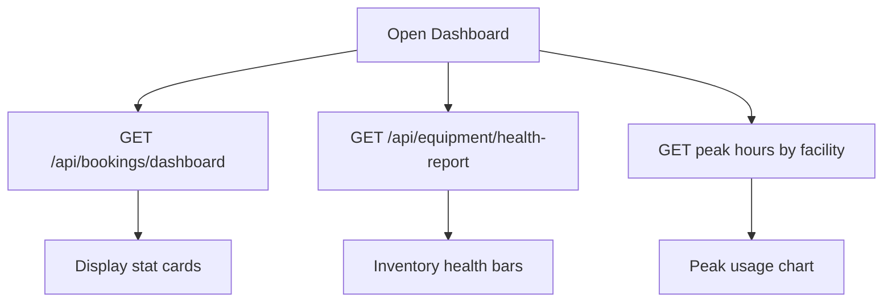

# E-SUKAN — PROJECT PROPOSAL REPORT

**Course:** CSC584 — Group Project  
**System Name:** E-Sukan (Campus Facility & Equipment Booking System)  
**Technology:** Java 17, Jakarta Servlet 6, JDBC (HikariCP), MySQL/H2, HTML/CSS/JavaScript  

---

## Table of Contents

| Section | Title | Page |
|---------|--------|------|
| 1.0 | Project Overview | 1 |
| 2.0 | Problem Statement | 1 |
| 3.0 | Objective | 1 |
| 4.0 | Proposed User Interface | 1 |
| 5.0 | Database Design | 2 |
| 6.0 | Flow of Application | 2 |

---

## 1.0 PROJECT OVERVIEW

**E-Sukan** is a web-based information system for managing campus sports facilities and equipment at a university. The system allows students and lecturers to book sports courts (badminton and futsal), rent equipment (rackets, balls, protective gear), join facility waitlists when slots are full, pay for bookings and rentals, and participate in tournaments organized by lecturers. Administrators manage users, facilities, equipment, bookings, and system settings.

The application follows a **three-tier architecture**:

| Layer | Description |
|-------|-------------|
| **Presentation** | Responsive single-page dashboard (`login.html`, `index.html`) with custom CSS (Syne + DM Sans fonts), sidebar navigation, modals, and REST API calls |
| **Business logic** | Jakarta Servlet 6 servlets exposing JSON APIs (`/api/bookings`, `/api/equipment`, `/api/tournaments`, etc.) |
| **Data** | Relational database (`esukan_db`) with 14 tables; HikariCP connection pool; schema in `sql/schema.sql` |

**User roles:**

| Role | Main capabilities |
|------|-----------------|
| **STUDENT** | Register/login, book facilities, rent equipment, join waitlist, pay online, register tournament teams, view dashboard reports |
| **LECTURER** | Same as student plus create/manage tournaments |
| **ADMIN** | Full access including user management, facility/equipment CRUD, booking approval, system settings |

**Authentication:** JWT-based login after registration; password reset via token; BCrypt password hashing; role-based menu visibility on every screen.

---

## 2.0 PROBLEM STATEMENT

Campus sports operations at many institutions still rely on **manual or fragmented processes**, which cause the following problems:

1. **Double booking and scheduling conflicts** — Students book courts via paper forms, WhatsApp, or spreadsheets with no real-time availability check, leading to overlapping reservations.

2. **Poor equipment tracking** — Rackets, balls, and gear are lent without a central record of quantity, condition (available, damaged, in maintenance), or return status, causing loss and unfair allocation.

3. **No waitlist when facilities are full** — When a time slot is taken, students have no structured FIFO queue; staff must handle requests manually.

4. **Weak payment and cost visibility** — Booking costs and rental deposits are not linked to digital payment records, making reconciliation difficult.

5. **Tournament management is disconnected** — Lecturers run events using separate tools; team registration, brackets, and venue booking are not integrated with facility data.

6. **Limited reporting for decision-making** — Management lacks dashboards for peak usage hours, inventory health, and booking trends.

7. **Security and accountability gaps** — Shared accounts or informal sign-in do not provide proper session control, input validation, or audit trails per user role.

These problems reduce efficiency, increase admin workload, and create a poor experience for students and staff using campus sports facilities.

---

## 3.0 OBJECTIVE

Based on the problems above, the objectives of **E-Sukan** are:

| # | Objective |
|---|-----------|
| 1 | Provide a **centralized online platform** for facility booking with date/time selection and conflict prevention |
| 2 | Implement **equipment rental management** with stock quantity, status, deposit, and return workflow |
| 3 | Support a **booking waitlist** with automatic promotion when a booking is cancelled |
| 4 | Record **payments** linked to bookings and rentals with status tracking (pending, paid, failed) |
| 5 | Enable **tournament lifecycle** management (create, open registration, team members, match bracket) tied to users and facilities |
| 6 | Deliver **analysis reports** on the dashboard (booking statistics, inventory health, peak usage hours) |
| 7 | Enforce **secure access** through registration, JWT session tokens, role-based features, and server-side input validation |
| 8 | Offer a **consistent, responsive user interface** with navigation on every screen for all roles |

---

## 4.0 PROPOSED USER INTERFACE

The UI uses a **custom responsive template** (CSS variables, sidebar layout, card components—not Bootstrap/Tailwind, but equivalent structured design). Screens are implemented in `src/main/resources/static/`.

> **For submission:** Capture screenshots from `http://localhost:9090` after `mvn jetty:run` and paste below each description.

### UI 1 — Login & Registration (`login.html`)

- Split layout: hero panel + auth card  
- Tabs: **Sign in** / **Register**  
- Fields: username, password; register adds email, full name, student ID  
- Links: Forgot password → `reset.html`  
- Success/error messages for validation feedback  

**[Insert screenshot: Login page]**

---

### UI 2 — Dashboard (`index.html` → Dashboard)

- Sidebar: Dashboard, Facilities, My bookings, Equipment, Rentals, Tournaments, Users (admin)  
- Stat cards: Total bookings, Today’s bookings, Pending approval, Unhealthy equipment  
- **Inventory Health Report** (bar chart by equipment status)  
- **Peak Usage Hours** (per facility)  
- Today’s schedule table  

**[Insert screenshot: Dashboard]**

---

### UI 3 — Facilities & Booking (`index.html` → Facilities)

- List/grid of facilities (badminton, futsal) with type, hours, cost per hour  
- **New Booking** modal: facility, date, start/end time, notes  
- Payment gateway modal for confirmed cost  
- Admin: add/edit/delete facilities  

**[Insert screenshot: Facilities & booking modal]**

---

### UI 4 — Equipment & Rentals (`index.html` → Equipment / Rentals)

- Equipment catalog with category, status, quantity, rental cost  
- Rent action with quantity and deposit  
- Rentals list: active, returned, overdue; return equipment action  
- Admin: CRUD equipment, update status  

**[Insert screenshot: Equipment and Rentals]**

---

### UI 5 — Tournaments (`index.html` → Tournaments)

- Lecturer/Admin: create tournament (title, dates, format, venue facility)  
- Student: register team and members when status is OPEN  
- View matches / bracket progression  
- Admin/Lecturer: update status (DRAFT → OPEN → CLOSED → COMPLETED)  

**[Insert screenshot: Tournaments]**

---

### UI 6 — User Management — Admin only (`index.html` → Users)

- Table of users: username, email, role, enabled  
- Create user, edit role, enable/disable account  

**[Insert screenshot: Admin Users]**

---

### UI 7 (optional) — Password Reset (`reset.html`)

- Enter reset token and new password  

**[Insert screenshot: Reset password]**

---

### Navigation consistency (scoresheet: User friendly)

Every authenticated page shares:

- Fixed **sidebar** with role-filtered menu (`data-roles` in HTML)  
- **Top bar** with page title and primary action button (+ New Booking, etc.)  
- **User chip** and logout in sidebar footer  

---

## 5.0 DATABASE DESIGN

The database **`esukan_db`** contains **14 tables**. Design source: `sql/schema.sql`. Visual ERD: `docs/esukan-erd.png` or import `docs/esukan-erd.dbml` into [dbdiagram.io](https://dbdiagram.io).

### 5.1 Table structure

| Table | Purpose | Key attributes |
|-------|---------|----------------|
| `system_settings` | Global config | `setting_key` PK, `setting_value` |
| `users` | Accounts | `id` PK, `username` UK, `email` UK, `role`, `password_hash` |
| `password_reset_tokens` | Password recovery | `token` UK, `user_id` FK |
| `facilities` | Courts/venues | `name`, `type`, `open_time`, `close_time`, `cost_per_hour` |
| `equipment` | Inventory | `name`, `category`, `status`, `quantity`, `cost_per_hour` |
| `facility_equipment` | M:N link | `facility_id`, `equipment_id` (composite PK) |
| `bookings` | Facility reservations | `facility_id` FK, `user_id` FK, `booking_date`, `start_time`, `end_time`, `status` |
| `booking_waitlist` | FIFO waitlist | Same time fields as bookings, `promoted_booking_id` |
| `equipment_rentals` | Equipment checkout | `equipment_id` FK, `user_id` FK, `deposit_amount`, `status` |
| `payments` | Transactions | `booking_id` FK, `rental_id` FK, `method`, `amount`, `status` |
| `tournaments` | Events | `organizer_id` FK, `venue_facility_id` FK, `format`, `status` |
| `tournament_registrations` | Teams | `tournament_id` FK, `team_name`, `registered_by_user_id` FK |
| `tournament_team_members` | Roster | `registration_id` FK, `display_name`, `email` |
| `tournament_matches` | Bracket | `team_a/b/winner_registration_id` FK, `next_match_id` self-FK |

**[Insert figure: ERD diagram — use `docs/esukan-erd.png` or export from dbdiagram.io]**

### 5.2 Relationships between tables (summary)

| Parent (1) | Child (many) | Relationship |
|------------|--------------|--------------|
| `users` | `password_reset_tokens`, `bookings`, `booking_waitlist`, `equipment_rentals`, `tournaments`, `tournament_registrations` | One user → many records |
| `facilities` | `bookings`, `booking_waitlist`, `tournaments`, `facility_equipment` | One facility → many uses |
| `equipment` | `equipment_rentals`, `facility_equipment` | One equipment → many rentals |
| `bookings` / `equipment_rentals` | `payments` | Optional payment per booking or rental |
| `tournaments` | `tournament_registrations`, `tournament_matches` | One event → many teams/matches |
| `tournament_registrations` | `tournament_team_members`, `tournament_matches` | Team roster and match participants |
| `tournament_matches` | `tournament_matches` | Self-reference for bracket (`next_match_id`) |

**Cardinality:** Crow’s foot notation — one side (`1`) to many side (N) on the ERD.

---

## 6.0 FLOW OF APPLICATION

### 6.1 High-level system flow



### 6.2 Create / Read (CR) — Score: Flow § Create/Read



| Module | Create | Read |
|--------|--------|------|
| Auth | Register user | Login, GET `/api/auth/me` |
| Facilities | Admin POST facility | GET list, view details |
| Bookings | POST booking + payment | GET my bookings, dashboard stats |
| Equipment | Admin POST equipment | GET catalog, health report |
| Rentals | POST rental | GET active/returned rentals |
| Tournaments | Lecturer POST tournament; student register team | GET tournaments, matches |
| Users | Admin POST user | GET user list |

**UI feedback:** Success toast/message after create (e.g. “Booking created successfully”).

### 6.3 Update — Score: Flow § Update



**UI feedback:** Confirmation dialog before update; success message after API success.

### 6.4 Delete — Score: Flow § Delete



| Entity | Who can delete |
|--------|----------------|
| Booking | Student/Admin cancel booking |
| Facility / Equipment | Admin |
| User | Admin |
| Tournament | Lecturer/Admin (draft/remove) |

### 6.5 Report (Analysis) — Score: Flow § Report



**Reports provided:**

- Total / today / pending bookings  
- Equipment health (available vs damaged vs maintenance)  
- Peak usage hours per facility  
- Today’s booking schedule table  

---

## APPENDIX A — Mapping to Scoresheets

### Scoresheet: Proposal (Total /20)

| Criterion | Max | How E-Sukan addresses it |
|-----------|-----|---------------------------|
| Overview, problem, objective | 5 | Sections 1.0–3.0 |
| Design / storyboard / template | 5 | Section 4.0 (7 UI screens, consistent layout) |
| Table structure | 3 | Section 5.1 (14 tables, PK/FK/types) |
| Relationship between tables | 3 | Section 5.2 + ERD |
| Create/Read flow | 1 | Section 6.2 |
| Update flow | 1 | Section 6.3 |
| Delete flow | 1 | Section 6.4 |
| Report flow | 1 | Section 6.5 |

### Scoresheet: Information System (Total /20)

| Criterion | Max | Evidence in project |
|-----------|-----|---------------------|
| Input validation | 2 | Servlet validation, HTML `required`, API error messages |
| Session management | 2 | JWT login, `Authorization: Bearer`, role checks |
| CRUD + success message | 2 | `app.js` toasts/alerts after API calls |
| Update + confirmation | 2 | Confirm dialogs on status change / return |
| Delete + confirmation | 2 | `confirm()` before DELETE |
| Report generation | 2 | Dashboard APIs and charts |
| Screen design (template) | 4 | Custom CSS design system (`style.css`, `auth.css`) |
| Consistent navigation | 4 | Sidebar on all `index.html` pages |

### Scoresheet: Presentation (Total /10)

Prepare video covering: organized demo (login → book → rent → report → admin), screenshots from Section 4.0, clear voice, background music optional.

---

## APPENDIX B — Files to Attach

| Item | Path |
|------|------|
| ERD image | `docs/esukan-erd.png` |
| DBML for dbdiagram.io | `docs/esukan-erd.dbml` |
| SQL schema | `sql/schema.sql` |
| Run instructions | `README.md` |

---

## APPENDIX C — Sample dbdiagram.io Code

Paste into https://dbdiagram.io (full file: `docs/esukan-erd.dbml`):

```dbml
Table users {
  id bigint [primary key, increment]
  username varchar(64) [unique, not null]
  email varchar(120) [unique, not null]
  role varchar(20) [not null]
}

Table facilities {
  id bigint [primary key, increment]
  name varchar(100) [not null]
  type varchar(20) [not null]
}

Table bookings {
  id bigint [primary key, increment]
  facility_id bigint [not null]
  user_id bigint
  booking_date date [not null]
  status varchar(20) [default: 'PENDING']
}

Ref: bookings.facility_id > facilities.id
Ref: bookings.user_id > users.id
```

*(Use complete `esukan-erd.dbml` for all 14 tables.)*

---

**End of Report**

*Group members: [Fill in names & matric numbers]*  
*Date: [Fill in submission date]*

---

### Word version (with cover page & page numbers)

| File | Description |
|------|-------------|
| `docs/PROJECT_PROPOSAL_REPORT.docx` | Ready-to-submit Word report (cover, TOC, ERD image, page footer) |
| `docs/build_proposal_docx.py` | Regenerate: `python docs/build_proposal_docx.py` |

**After opening in Word:** Replace red screenshot placeholders, edit group names on cover, press **Ctrl+A** then **F9** to refresh page numbers if needed.
